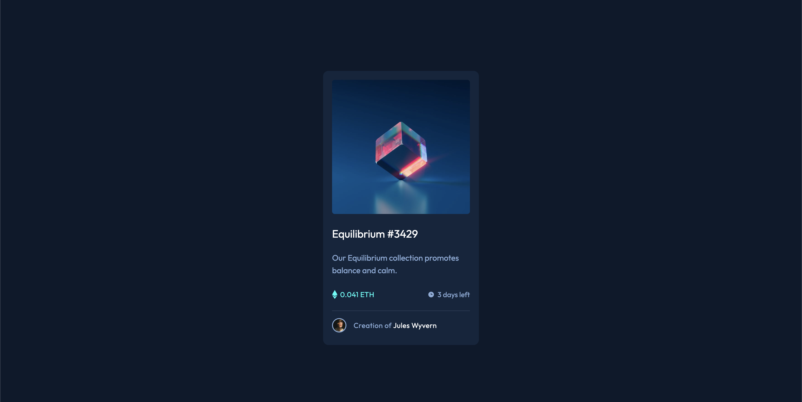
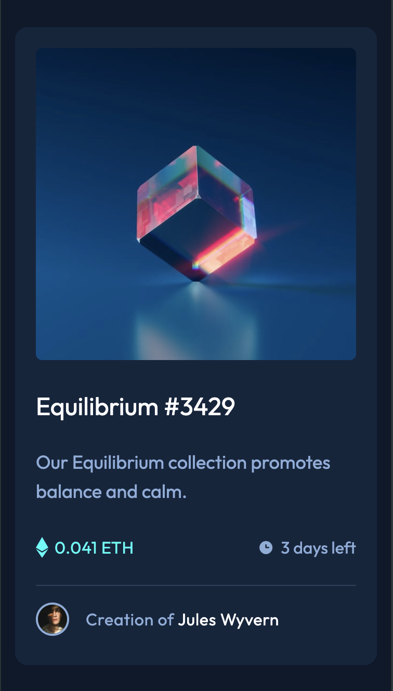
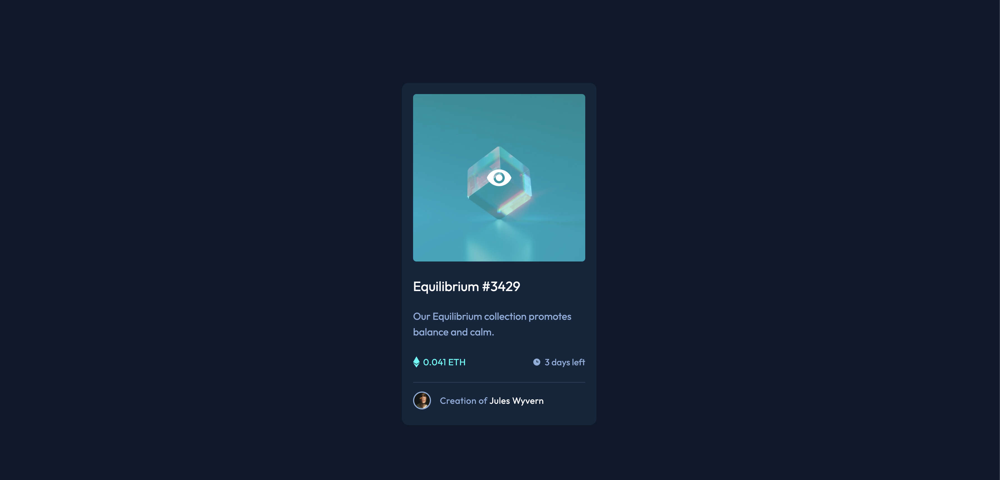

# Frontend Mentor - NFT preview card component solution

This is a solution to the [NFT preview card component challenge on Frontend Mentor]. Frontend Mentor challenges help you improve your coding skills by building realistic projects. 

## Table of contents

- [Overview](#overview)
  - [The challenge](#the-challenge)
  - [Screenshot](#screenshot)
  - [Links](#links)
- [My process](#my-process)
  - [What I learned](#what-i-learned)
- [Author](#author)

## Overview

### The challenge

Users should be able to:

- View the optimal layout depending on their device's screen size
- See hover states for interactive elements

### Screenshot

### Links

- Solution URL: (https://www.frontendmentor.io/solutions/nft-preview-card-3MWB_Q-tZT)
- Live Site URL: (https://bkfoe.github.io/nft-preview-card/)

## My process
### What I learned

This project required in the active state there was an image and background overlay on top of the main card image. Originally I thought about layering two div blocks and using the display settings to set one to none and then on hover setting it to block but I decided to use the invisible utility as I didnt want to remove the element from the page layout, I just wanted it to be invisible until the user hovered on the element.  
 
I set the card div to relative and the div for the image to be overlayed to absolute and I used the group modifier. The group modifier allowed me to style the child div based on the state of the parent div. Also dont forget to set the Z index of the child div higher so it overlays and that solved the challenge. 

## Author

- Website - [BKFOE ](https://github.com/BKFOE)
- Frontend Mentor - [@BKFOE](https://www.frontendmentor.io/profile/bkfoe)

